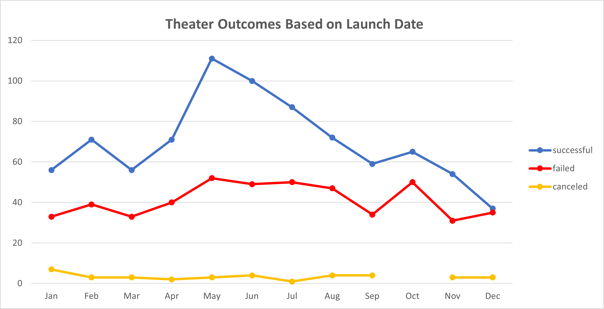
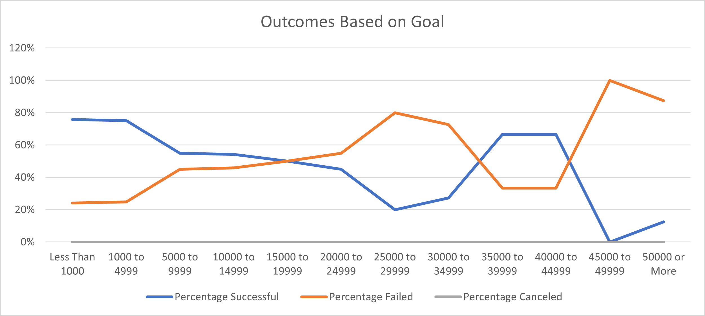

<h1 align="center">
 Kickstarting with Excel
  </h1>

# Overview of Project
This project looks into the outcomes based of goal and launch date. The outcomes of campaign were classified into three categories: successful, failed, and canceled.  The goal, on the other hand, was sorted into various categories from under 1000 up to 50,000 and more.

## Purpose
This analysis aims to examine the realtionship between the campaign outcomes with the goals and launch date. 
## Analysis and Challenges
### Theater Outcomes by Launch Date

First, I  created a pivot table from the specified worksheet and filtered it based on two elements: the parent category and years. Then I organized the table by adding more details like rows, columns, and values. Next, I filtered the columns based on successful, failed, and canceled of the project, and I removed the live category. On the other hand, I filtered the parent category based on the date of the theater. For this step, I sort the campaign results in a descending order. After that, I stablish the line chart from the pivot table to visualize the relationship between outcomes and launch date based on month. Last I add filter to the topic of the chart and save all the work and printed the cart into a PNG file.

The graph shows the rate of successful theater campaigns compared to the failed and the canceled ones throughout the year. As shown in the graph, the successful campaigns were below 60 in January. They increased slightly till February, but they decreased until March (about 56). However, they significantly increased during the period from March to May (reaching a climax of around 110). Interestingly, we notice a sharp decrease from May through September. They went up slightly during October but continue falling down till the end of the year. Regarding the canceled campaigns, they were pretty steady and stayed at a minimum falling below seven. On the other hand, the failed campaigns were under 40 in January. They slightly increased till February (reaching 39), but they decreased in March. Then they went up until May and stayed steady until August. They fell down in September and went up again in October, but they decreased in November. Lastly from November till the end of the year, they had a bit of increase.   
### Outcomes Based on Goals
 
This line chart shows the outcomes of the campaigns based on goal compared to the percentage of successful, failed, and canceled from less than 1000 to 50000 or more goals. As shown in the graph, the success was a bit below 80% when the goals were less than 1000. They stayed steady till they were up to 4999 then the percentage dropped down when the goals increased from 5000 to 9999. However, it experienced a continuous decline until they were between 25000 to 29999 (20%). Then it went up till 62% when the goals were between 35000 to 39999. After that it was a steady then it went down significantly reaching the lowest point (0%) when the goals were 45000 to 49999. Finally, it raised again with 50000 or more.
 On the other hand, the failure in the campaign based on the goals was a bit above 20% when the goal was less than 1000. It continued steady until the goal was 1000 to 4999 (20%). Then it started raising up just above 40% when the goal was 5000 to 9999. Then, it went up slowly until it reached to 45% when the goal was 25000 to 29999 the failure was (80%). After that, it fell down till it reached to 33% when the goal was 35000 to 39999.  Between 35000 to 44999 the failure was 33%. However, it went up significantly to 100% when the goal was 45000 to 49999. Lastly, it dropped down to 88% when the was 50000 or more. There were no recorded canceled champaigns.

### Analysis of Outcomes Based on Launch Date
The graph shows the theater outcomes based on launch date. It successed a noticeable increase in January. It started just below 60% until 76% in February and it went down to where it was in March. Then it significantly increases until it get to 116% in May. It went down. On the othr hand the fail of data was way less then success it was under 40% in January and it nonlinen till it meet with the success in December. Finally, the canceled was steady all the period of  time.     
### Analysis of Outcomes Based on Goals
The graph shows that when the goal was less than 1000 the percentage of success was way more higher than the fail. But when the goal starts to increase, they switch. That explains that the success starts decreasing vice the failure which starts increase.

### Challenges and Difficulties Encountered
There are two challenges that I faced when I was doing this project. The first is when i convert the time from unix to regular format. The socend is figuring out how to do the screenshot link to the read me.

## Results

- What are two conclusions you can draw about the Outcomes based on Launch Date?

- What can you conclude about the Outcomes based on Goals?

- What are some limitations of this dataset?

- What are some other possible tables and/or graphs that we could create?
